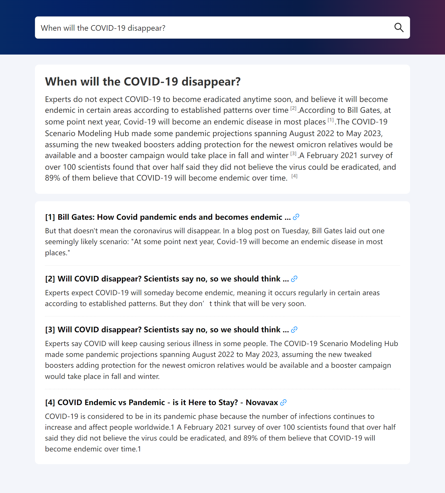
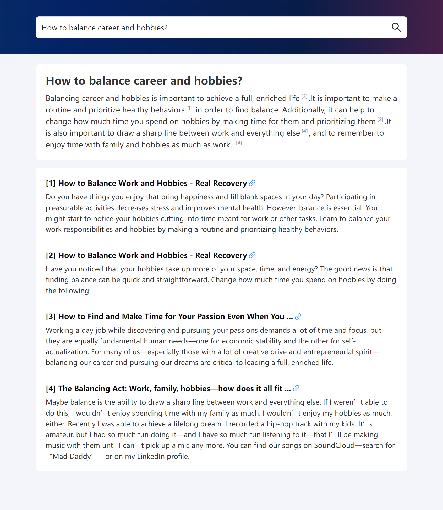
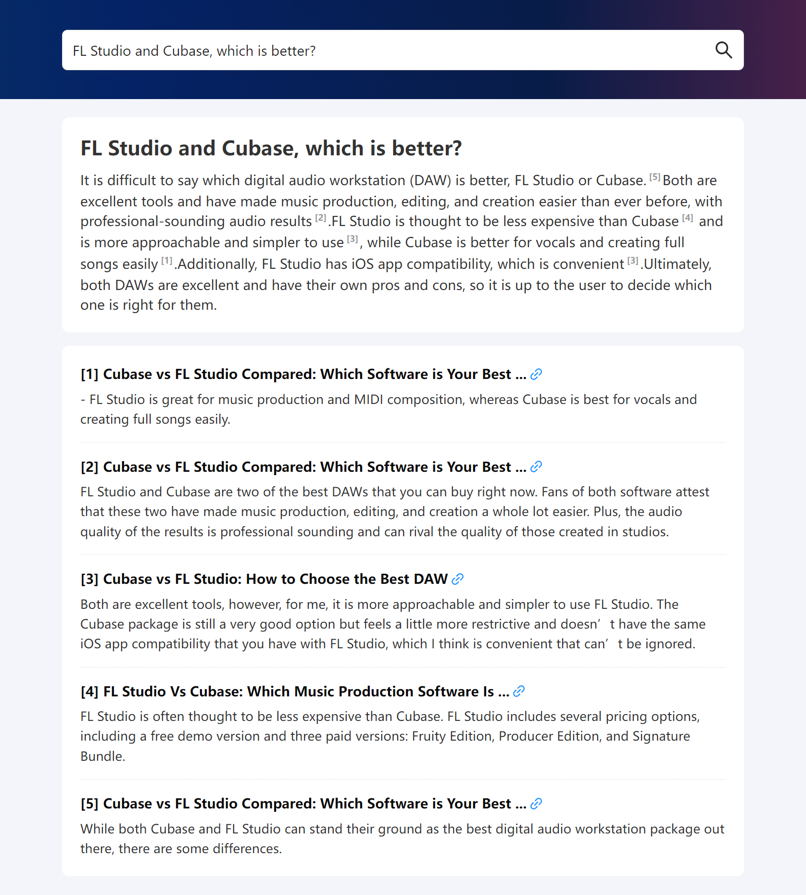
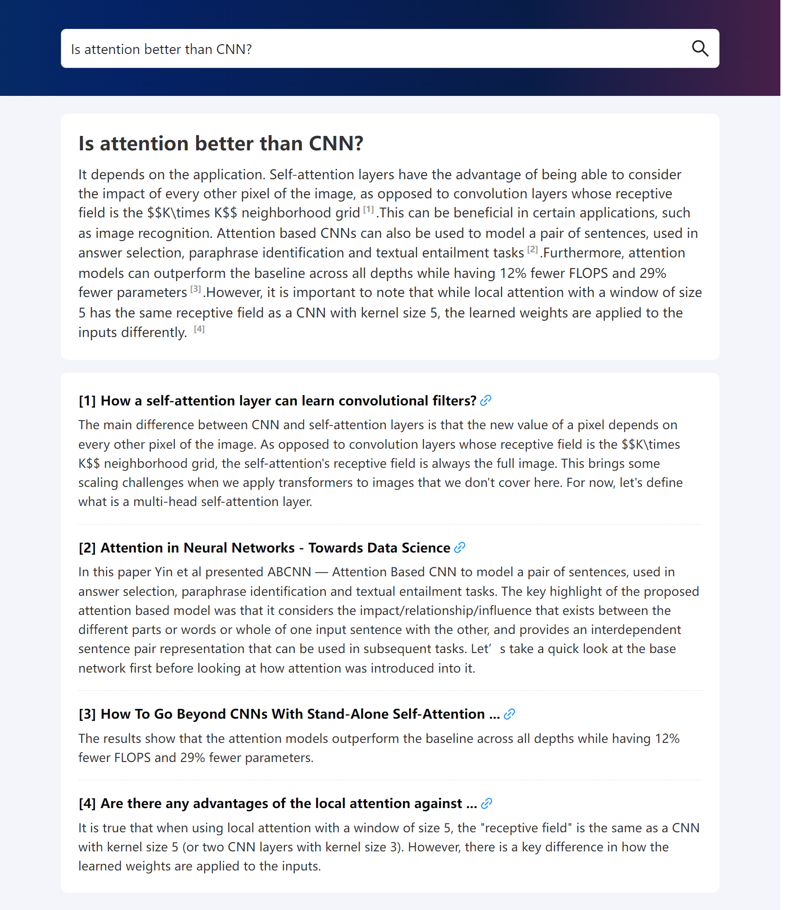
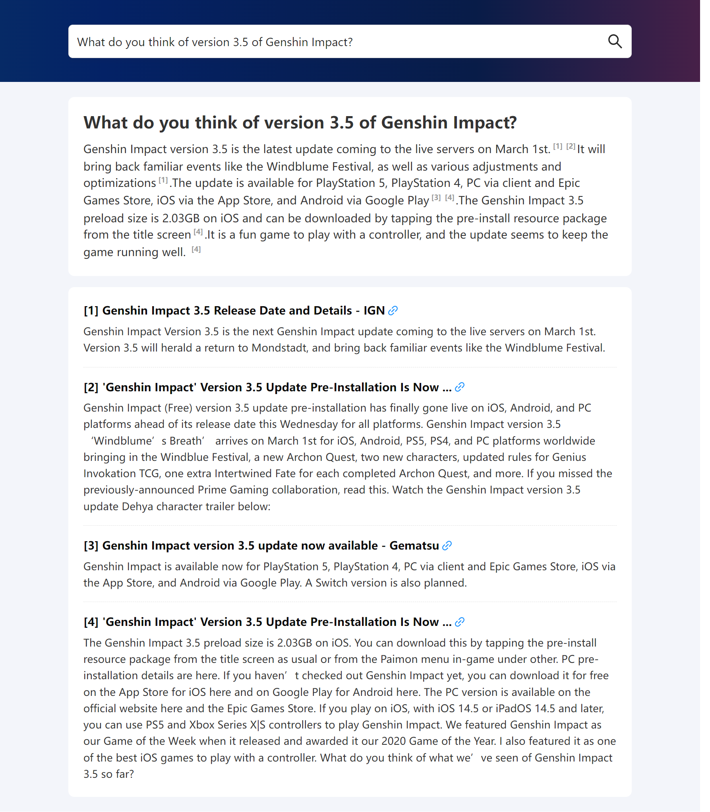
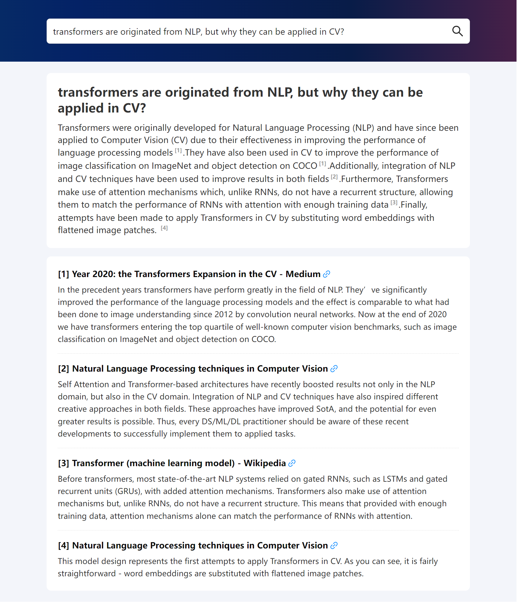
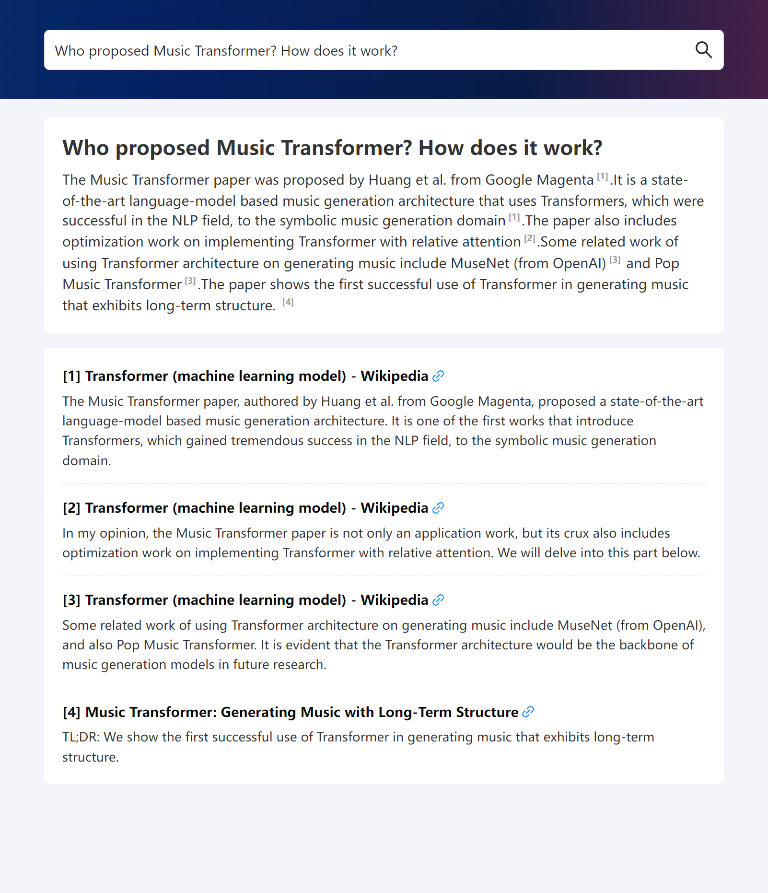
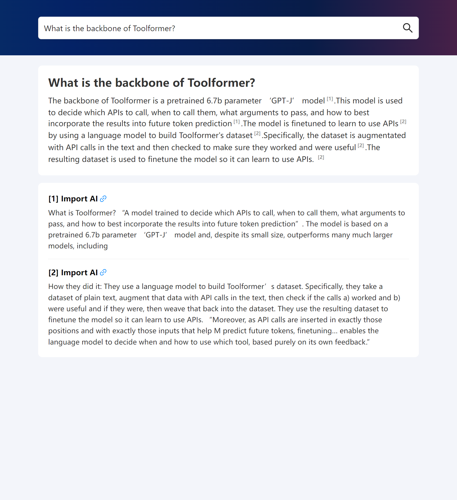

<h1>WebGLM: Towards An Efficient Web-enhanced Question Answering System with Human Preferences</h1>

<p align="center">📃 <a href="https://arxiv.org/pdf/2306.07906.pdf" target="_blank">Paper (KDD'23)</a> • 🌐 <a href="https://github.com/THUDM/WebGLM/blob/main/README_zh.md" target="_blank">中文 README</a> • 🤗 HF Repo <a href="https://huggingface.co/THUDM/WebGLM" target="_blank">[WebGLM-10B]</a> <a href="https://huggingface.co/THUDM/WebGLM-2B" target="_blank">[WebGLM-2B]</a> • 📚 Dataset <a href="https://huggingface.co/datasets/THUDM/webglm-qa" target="_blank">[WebGLM-QA]</a></p>

This is the official implementation of WebGLM. If you find our open-sourced efforts useful, please 🌟 the repo to encourage our following developement!

<!--https://github.com/THUDM/WebGLM/assets/129033897/d2e1dd35-6340-4175-ac2d-fd585daa17cf-->

**[Please click to watch the demo!]**

[](https://www.youtube.com/watch?v=ohjrlYCLLEU)

_Read this in [中文](README_zh.md)._

## Update
**[2023/06/25]** Release [ChatGLM2-6B](https://github.com/THUDM/ChatGLM2-6B), an updated version of [ChatGLM-6B](https://github.com/THUDM/ChatGLM-6B) which introduces several new features:

1. **Stronger Performance**: we have fully upgraded the ChatGLM2-6B. It uses the hybrid objective function of [GLM](https://github.com/THUDM/GLM), and has undergone pre-training with 1.4T bilingual tokens and human preference alignment training. The [evaluation results](README.md#evaluation-results) show that, compared to the first-generation model, ChatGLM2-6B has achieved substantial improvements in performance on datasets like MMLU (+23%), CEval (+33%), GSM8K (+571%), BBH (+60%), showing strong competitiveness among models of the same size.
2. **Longer Context**: Based on [FlashAttention](https://github.com/HazyResearch/flash-attention) technique, we have extended the context length of the base model from 2K in ChatGLM-6B to 32K, and trained with a context length of 8K during the dialogue alignment, allowing for more rounds of dialogue. However, the current version of ChatGLM2-6B has limited understanding of single-round ultra-long documents, which we will focus on optimizing in future iterations.
3. **More Efficient Inference**: Based on [Multi-Query Attention](http://arxiv.org/abs/1911.02150) technique, ChatGLM2-6B has more efficient inference speed and lower GPU memory usage: under the official  implementation, the inference speed has increased by 42% compared to the first generation; under INT4 quantization, the dialogue length supported by 6G GPU memory has increased from 1K to 8K.

More details please refer to [ChatGLM2-6B](https://github.com/THUDM/ChatGLM2-6B)。

<!-- TOC -->

-   [Overview](#overview)
    -   [Features](#features)
-   [News](#news)
-   [Preparation](#preparation)
    -   [Prepare Code and Environments](#prepare-code-and-environments)
    -   [Prepare SerpAPI Key](#prepare-serpapi-key)
    -   [Prepare Retriever Checkpoint](#prepare-retriever-checkpoint)
-   [Try WebGLM](#try-webglm)
    -   [Export Environment Variables](#export-environment-variables)
    -   [Run as Command Line Interface](#run-as-command-line-interface)
    -   [Run as Web Service](#run-as-web-service)
-   [Train WebGLM](#train-webglm)
    -   [Train Generator](#train-generator)
        -   [Prepare Data](#prepare-data)
        -   [Training](#training)
    -   [Train Retriever](#train-retriever)
        -   [Prepare Data](#prepare-data-1)
        -   [Training](#training-1)
-   [Evaluation](#evaluation)
-   [Real Application Cases](#real-application-cases)
-   [Citation](#citation)

# Overview


WebGLM aspires to provide an efficient and cost-effective web-enhanced question-answering system using the 10-billion-parameter General Language Model (GLM). It aims to improve real-world application deployment by integrating web search and retrieval capabilities into the pre-trained language model.

## Features

-   **LLM-augmented Retriever**: Enhances the retrieval of relevant web content to better aid in answering questions accurately.
-   **Bootstrapped Generator**: Generates human-like responses to questions, leveraging the power of the GLM to provide refined answers.
-   **Human Preference-aware Scorer**: Estimates the quality of generated responses by prioritizing human preferences, ensuring the system produces useful and engaging content.

# News

-   **[2023-06-24]** We support searching via [Bing](https://www.bing.com/) now!
-   **[2023-06-14]** We release our code and the [paper](https://arxiv.org/pdf/2306.07906.pdf) of WebGLM!

# Preparation

## Prepare Code and Environments

Clone this repo, and install python requirements.

```bash
pip install -r requirements.txt
```

Install Nodejs.

```bash
apt install nodejs # If you use Ubuntu
```

Install playwright dependencies.

```bash
playwright install
```

If browsing environments are not installed in your host, you need to install them. Do not worry, playwright will give you instructions when you first execute it if so.

## Prepare SerpAPI Key

In search process, we use SerpAPI to get search results. You need to get a SerpAPI key from [here](https://serpapi.com/).

Then, set the environment variable `SERPAPI_KEY` to your key.

```bash
export SERPAPI_KEY="YOUR KEY"
```

Alternatively, you can use Bing search with local browser environment (playwright). You can add `--searcher bing` to start command lines to use Bing search. (See [Run as Command Line Interface](#run-as-command-line-interface) and [Run as Web Service](#run-as-web-service))

## Prepare Retriever Checkpoint

Download the checkpoint on [Tsinghua Cloud](https://cloud.tsinghua.edu.cn/d/bc96946dd9a14c84b8d4/) by running the command line below.

You can manually specify the path to save the checkpoint by `--save SAVE_PATH`.

```bash
python download.py retriever-pretrained-checkpoint
```

# Try WebGLM

Before you run the code, make sure that the space of your device is enough.

## Export Environment Variables

Export the environment variable `WEBGLM_RETRIEVER_CKPT` to the path of the retriever checkpoint. If you have downloaded the retriever checkpoint in the default path, you can simply run the command line below.

```bash
export WEBGLM_RETRIEVER_CKPT=./download/retriever-pretrained-checkpoint
```

## Run as Command Line Interface

You can try WebGLM-2B model by:

```bash
python cli_demo.py -w THUDM/WebGLM-2B
```

Or directly for WebGLM-10B model:

```bash
python cli_demo.py
```

If you want to use Bing search instead of SerpAPI, you can add `--searcher bing` to the command line, for example:

```bash
python cli_demo.py -w THUDM/WebGLM-2B --searcher bing
```

## Run as Web Service

Run `web_demo.py` with the same arguments as `cli_demo.py` to start a web service.
For example, you can try WebGLM-2B model with Bing search by:

```bash
python web_demo.py -w THUDM/WebGLM-2B --searcher bing
```

# Train WebGLM

## Train Generator

### Prepare Data (WebGLM-QA)

Download the training data (WebGLM-QA) on [Tsinghua Cloud](https://cloud.tsinghua.edu.cn/d/d290dcfc92e342f9a017/) by running the command line below.

```bash
python download.py generator-training-data
```

It will automatically download all the data and preprocess them into the seq2seq form that can be used immediately in `./download`.

### Training

Please refer to [GLM repo](https://github.com/THUDM/GLM#train-with-your-own-data) for seq2seq training.

## Train Retriever

### Prepare Data

Download the training data on [Tsinghua Cloud](https://cloud.tsinghua.edu.cn/d/3927b67a834c475288e2/) by running the command line below.

```bash
python download.py retriever-training-data
```

### Training

Run the following command line to train the retriever. If you have downloaded the retriever training data in the default path, you can simply run the command line below.

```bash
python train_retriever.py --train_data_dir ./download/retriever-training-data
```

# Evaluation

You can reproduce our results on TriviaQA, WebQuestions and NQ Open. Take TriviaQA for example, you can simply run the command line below:

```bash
bash scripts/triviaqa.sh
```

and start running the experiment.

# Real Application Cases

[Here](assets/cases) you can see some examples of WebGLM real application scenarios.

<details><summary><b>When will the COVID-19 disappear?</b></summary>



</details>

<details><summary><b>How to balance career and hobbies?</b></summary>



</details>

<details><summary><b>FL Studio and Cubase, which is better?</b></summary>



</details>

<details><summary><b>Is attention better than CNN?</b></summary>



</details>

<details><summary><b>How to survive in the first-tier cities without a high-salary work?</b></summary>


</details>

<details><summary><b>What do you think of version 3.5 of Genshin Impact?</b></summary>



</details>

<details><summary><b>transformers are originated in NLP, but why they can be applied in CV?</b></summary>



</details>

<details><summary><b>Who proposed Music Transformer? How does it work?</b></summary>



</details>

<details><summary><b>What is the backbone of Toolformer?</b></summary>



</details>

# License

This repository is licensed under the [Apache-2.0 License](LICENSE). The use of model weights is subject to the [Model_License](MODEL_LICENSE). All open-sourced data is for resarch purpose only.

# Citation

If you use this code for your research, please cite our paper.

```
@misc{liu2023webglm,
      title={WebGLM: Towards An Efficient Web-Enhanced Question Answering System with Human Preferences},
      author={Xiao Liu and Hanyu Lai and Hao Yu and Yifan Xu and Aohan Zeng and Zhengxiao Du and Peng Zhang and Yuxiao Dong and Jie Tang},
      year={2023},
      eprint={2306.07906},
      archivePrefix={arXiv},
      primaryClass={cs.CL}
}
```

> This repo is simplified for easier deployment.
